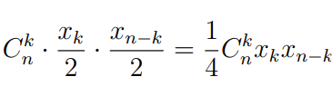

# Запрограмировать решение рекурсивной функции

## Задача: 
Шеренга солдат называется неправильной, если никакие три подряд стоящих солдата не стоят по росту (ни в порядке возрастания, ни в порядке убывания). Сколько неправильных шеренг можно построить из n солдат разного роста?

## Решение: 
На вход принимается колличество солдат в шеренге - n

Нахождение колличества неправильных шеренг происходит по формуле:
  

В результате выводится колличество неправильных шеренг

Результат выполнения программы представлен на рисунке ниже

!(./quest1.png)
